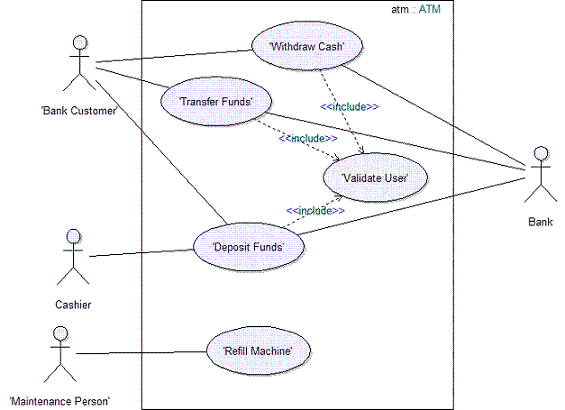
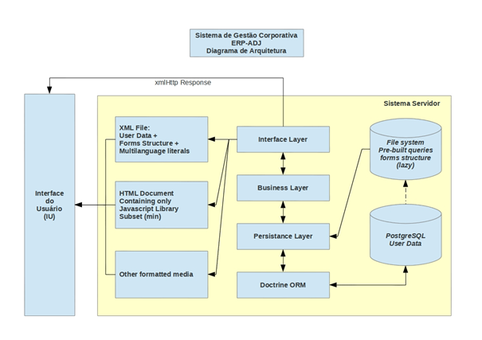

<table>
<tr>
<table>
<tr>
<td>
<td>
</td>
</tr>
</table>

**Nome do Projeto**: nome do projeto
	
**Nome do Parceiro**:  nome do parceiro
	
**Nome do Grupo**: nome do grupo
	
**Integrantes do grupo**
<ul> <li href="https://www.linkedin.com/in/seulogin/">Nome do integrante 1 </li>
 <li href="https://www.linkedin.com/in/seulogin/">Nome do integrante 2 </li>
 <li href="https://www.linkedin.com/in/seulogin/">Nome do integrante 2 </li> 
 <li href="https://www.linkedin.com/in/seulogin/">Nome do integrante 3 </li> 
 <li href="https://www.linkedin.com/in/seulogin/">Nome do integrante 4 </li>
 <li href="https://www.linkedin.com/in/seulogin/">Nome do integrante 5 </li> 
<li href="https://www.linkedin.com/in/seulogin/">Nome do integrante 6</l>
</ul>

**Módulo 5 - Engenharia de Software**
	
**Nome do projeto**

## Conteúdo
**[1. Visão Geral do Projeto](#1-visão-geral-do-projeto)**

  * [1.1. Parceiro de Negócios](#11-parceiro-de-negócios)
    * [1.1.1. Partes Interessadas](#111-partes-interessadas)
    * [1.1.2. Análise da Indústria](#112-análise-da-indústria)
  * [1.2. Problema](#12-problema)
    * [1.2.1. Análise do Problema](#121-análise-do-problema)
    * [1.2.2 Análise do cenário: Matriz SWOT](#122-análise-do-cenário-matriz-swot)
  * [1.3. Descritivo da Solução](#13-descritivo-da-solução)
    * [1.3.1. Objetivos](#131-objetivos)
    * [1.3.2. Proposta de Valor: Value Proposition Canvas](#132-proposta-de-valor-value-proposition-canvas)
    * [1.3.3. Matriz de Risco](#133-matriz-de-risco)
  * [1.4. Proposta Tecnológica e Benefícios](#14-proposta-tecnológica-e-benefícios)
    * [1.4.1. Tipo de arquitetura de nuvem escolhida](#141-tipo-de-arquitetura-de-nuvem-escolhida)
    * [1.4.2. Arquitetura de nuvem escolhida](#142-arquitetura-de-nuvem-escolhida)
    * [1.4.3. Benefícios trazidos pela arquitetura de nuvem proposta](#143-benefícios-trazidos-pela-arquitetura-de-nuvem-proposta)

**[2. Entendimento da Experiência do Usuário](#2-entendimento-da-experiência-do-usuário)**

  * [2.1. Perfis de Usuários](#21-perfis-de-usuários)
    * [2.1.1. Personas](#211-personas)
  * [2.2. Mapa de Jornada do Usuário](#22-mapa-de-jornada-do-usuário)
  * [2.3. Wireframes](#23-wireframes)

**[3. Requisitos](#3-requisitos)**

  * [3.1. Requisitos Funcionais](#31-requisitos-funcionais)
    * [3.1.1. Casos de Uso](#311-casos-de-uso)
    * [3.1.2. User Stories](#312-user-stories)
  * [3.2. Requisitos não Funcionais](#32-requisitos-não-funcionais)

**[4. Arquitetura do Sistema](#4-arquitetura-do-sistema)**

  * [4.1. Diagrama de Arquitetura](#41-diagrama-de-arquitetura)
  * [4.2. Diagrama de Implantação](#42-diagrama-de-implantação)
    * [4.2.1. Procedimentos de implantação da solução](#421-componentes-que-compões-a-solução)
    * [4.2.2. Procedimentos de implantação da solução](#422-procedimentos-de-implantação-da-solução)
  * [4.3. Diagrama de Sequência](#43-diagrama-de-sequência)

**[5. Projeto e Implementação UX e UI](#5-projeto-e-implementação-ux-e-ui)**

  **[5.1. Frontend](#51-frontend)**

**[6. Projeto de Banco de Dados](#6-projeto-de-banco-de-dados)**

  **[6.1. Modelo Conceitual](#61-modelo-conceitual)**
  **[6.2. Modelo Lógico](#62-modelo-lógico)**

**[7. Testes de Software](#7-testes-de-software)**

**[8. Documentação da API](#8-documentação-da-api)**

**[Referências](#referências)**

**[Apêndice](#apêndice)**

# 1. Visão Geral do Projeto

## 1.1 Parceiro de Negócios

Faça uma breve descrição da instituição representada pelo parceiro de negócios, porte, onde atua, área de mercado que atua e posicionamento no mercado.

### 1.1.1 Partes Interessadas 
Descreva os principais stakeholders envolvidos no projeto e seus papéis.

### 1.1.2 Análise da Indústria
Analise a indústria (Modelo de 5 Forças de Porter) em relação ao cenário da empresa parceira.

## 1.2 Problema

Descreva o problema ou a oportunidade de negócio.

### 1.2.1 Análise do Problema

Descreva os problemas identificados e as necessidades do usuário, bem como uma avaliação da situação atual e as possíveis soluções para cada questão. Além disso, identifique os obstáculos e limitações do projeto, a fim de assegurar que todas as preocupações sejam abordadas antes do início da implementação. A Análise do Problema é essencial para garantir que a solução do software seja eficaz e atenda às necessidades dos usuários. É importante que seja realizada uma pesquisa exaustiva e que todas as perspectivas sejam consideradas para garantir que a solução seja bem-sucedida.

### 1.2.2 Análise do cenário: Matriz SWOT
Apresente a Matriz SWOT com análise da empresa parceira.

## 1.3 Descritivo da Solução

Descrição da solução a ser desenvolvida (o que é, quais as principais funcionalidades, como usar). Caso ainda não esteja definida a solução na Sprint 1, o faça assim que possível.

### 1.3.1 Objetivos

Descreva os objetivos do projeto, organizando em objetivos gerais e objetivos específicos.

### 1.3.2 Proposta de Valor: Value Proposition Canvas

Apresenta o Canvas de Proposta de Valor com relação à solução.

### 1.3.3  Matriz de Risco

Apresenta a matriz de risco com relação ao projeto.

## 1.4 Proposta Tecnológica e Benefícios

Descreva a proposta tecnológica baseada em nuvem que será adotada no projeto.

### 1.4.1 Tipo de arquitetura de nuvem escolhida

Descreva o tipo de arquitetura de nuvem escolhida e sua justificativa.

### 1.4.2 Arquitetura de nuvem escolhida

Descreva como a arquitetura de nuvem escolhida deverá ser utilizada.

### 1.4.3 Benefícios trazidos pela arquitetura de nuvem proposta

Descreva os benefícios trazidos pela arquitetura de nuvem proposta.

# 2. Entendimento da Experiência do Usuário

Inclua nesta seção os perfis de usuário e respectivas personas, e o mapa de jornada de usuário.

## 2.1. Perfis de Usuários 

Descreva instruções detalhadas sobre o uso de cada opção e recursos relacionados ao perfil de cada usuário, garantindo uma experiência fácil e intuitiva para o usuário final. 

### 2.1.1 Personas

Descreva exemplos de Personas que representam as partes reais interessadas no desenvolvimento, no resultado e/ou nas decisões tomadas a partir do sistema desenvolvido. Caracterize-as a partir de dores, necessidades e comportamentos específicos em relação ao problema que o projeto busca resolver.

## 2.2 Mapa de Jornada do Usuário

Associe ao perfil de cada usuário um mapa de jornada que é uma representação visual da experiência do usuário desde o início até o fim da interação com o produto ou serviço. Inserir o link com o artefato desenvolvido.

## 2.3 Wireframes

Descreva as telas de baixa fidelidade das áreas do usuário, de forma conectada, demonstrando a diagramação e o fluxo de navegação.
Exemplos: tela da home, tela de login, etc. Em cada tela colocar: cabeçalho, rodapé, barra lateral, área de conteúdo
Aqui você deve colocar o link para o wireframe ou colocar as imagens geradas na sequência correta do fluxo de navegação.
Além disso: forneça exemplos de como as funcionalidades do software são acessadas e usadas pelos usuários, incluindo informações sobre os passos necessários para realizar tarefas específicas; aborde as principais preocupações de UX, como acessibilidade, usabilidade, consistência e simplicidade; e apresente exemplos de como as telas foram pensadas para atender às necessidades dos usuários com diferentes tipos de habilidades e recursos.

# 3. Requisitos

Inclua nesta seção os requisitos funcionais e não funcionais da solução proposta. 

Esta seção é importante porque permite que os desenvolvedores entendam claramente o que é esperado do software e quais serão as restrições e desafios enfrentados durante o desenvolvimento. Além disso, permite que os usuários finais saibam se o software atende às suas expectativas e se está adequado ao seu ambiente de trabalho. 

Esta seção pode ser atualizada durante o ciclo de desenvolvimento do software, garantindo que todas as necessidades e especificações estejam sempre sendo consideradas.

## 3.1 Requisitos Funcionais

Descreva detalhadamente os requisitos do sistema. Inclua também informações sobre as funcionalidades esperadas do software, descrição de testes, as restrições e limitações do sistema e outras especificações relevantes.

### 3.1.1 Casos de Uso

Descreva os casos de uso da solução proposta. É importante entender que esta é uma parte importante da documentação do software pois descreve as suas funcionalidades e como elas serão utilizadas pelos usuários. Aqui, são listados todos os cenários possíveis de uso do software, incluindo as ações que o usuário pode realizar, as interações com o sistema e os resultados esperados. Os casos de uso devem ser descritos em detalhes, incluindo a descrição do objetivo da funcionalidade, as entradas de dados, as ações do usuário e os resultados esperados. Além disso, também devem ser incluídos os critérios de aceitação, que são os padrões que o software precisa atender para ser considerado como funcionando corretamente.

Os diagramas de caso de uso podem ser anexados aqui ou você pode adicionar o link para o drive (lembre-se de compartilhar com os professores). As User stories deverão ser escritas no Gut Huib Projects.

Exemplo de Diagrama de Casos de Uso

### 3.1.2 User Stories

Cada caso de uso descrito no item acima deverá ser detalhado no formato de User Story seguindo o formato abaixo:

Como PERFIL, DEVO/POSSO AÇÃO para OBJETIVO
PERFIL: perfil do usuário que realizará a ação
DEVO/POSSO: obrigatoriedade da ação
AÇÃO: o que será realizado
OBJETIVO: qual a finalidade da ação.

Exemplo:

    Eu, como analista de projetos, devo cadastrar um novo módulo de curso para uma disciplina para realizar a gestão e controle dos entregáveis.

## 3.2 Requisitos não funcionais

Descreva detalhadamente os requisitos não funcionais como requisitos de segurança, escalabilidade, uso de recursos e privacidade, por exemplo. Inclua também informações sobre os resultados esperados, descrição de testes, as restrições e limitações do sistema e outras especificações relevantes.

# 4.	Arquitetura do Sistema

Descreva a arquitetura da sua solução. A arquitetura de um sistema de software é uma descrição abrangente da estrutura e organização de uma solução tecnológica (software e hardware), incluindo seus componentes, relacionamentos, interfaces, padrões de comunicação e fluxo de dados. Ela fornece uma visão de alto nível da solução e define a maneira como os diferentes elementos se conectam e interagem para atender aos requisitos do sistema.

## 4.1.	Diagrama de Arquitetura

Atualizar a cada revisão/atualização da arquitetura, mantendo todas as versões no documento.

 
Exemplo de Diagrama de Arquitetura

## 4.2.	Diagrama de Implantação

Crie um diagrama de implantação do projeto com a solução proposta. O diagrama deverá descrever onde os módulos do sistema estarão implantados e os protocolos de comunicação utilizados entre eles. Inclua uma descrição textual completa do diagrama, e que mostra como requisitos não funcionais são suportados.

### 4.2.1.	Componentes que compões a solução

Descreva abaixo as tecnologias e ferramentas utilizadas para o desenvolvimento da solução

### 4.2.2.	Procedimentos de implantação da solução
	
Descreva abaixo o passo a passo para realizar a implantação da solução projetada em nuvem.

## 4.3.	Diagrama de Sequência

Crie diagramas de sequência UML mostrando a integração entre frontend e backend. Descreva as sequências de diagramas encadeando explicações que relacionam a sequência apresentada. Isso serve para contextualizar a leitura pela parte interessada.
 
# 5.	Projeto e Implementação UX e UI 

Descreva informações solicitadas no projeto sobre o design e a funcionalidade da aplicação ou sistema em questão. Ela fornece informações sobre como o software é projetado para ser fácil de usar e intuitivo para os usuários. Nesta seção, deve ser possível encontrar descrições detalhadas sobre as principais características e recursos da interface do usuário, como botões, menus, ícones e outros elementos que são utilizados para facilitar a interação do usuário com o software. 
Além disso: forneça exemplos de como as funcionalidades do software são acessadas e usadas pelos usuários, incluindo informações sobre os passos necessários para realizar tarefas específicas; aborde as principais preocupações de UX, como acessibilidade, usabilidade, consistência e simplicidade; e apresente exemplos de como o software foi projetado para atender às necessidades dos usuários com diferentes tipos de habilidades e recursos.
Organize a apresentação dessas informações no que foi pensado inicialmente durante o desenho do wireframe e, na sequência, o que foi desenvolvido no Frontend.

## 5.1.	Frontend

Descreva as telas desenvolvidas, de forma conectada, demonstrando o fluxo de navegação e observações sobre a implementação (verifique o que foi solicitado no artefato de entrega do projeto). Inclua qualquer informação que julgar relevante, como por exemplo, alterações necessárias de mudança da implementação em relação ao protótipo de baixa fidelidade. 

# 6.	Projeto de Banco de Dados

Descreva os modelos conceituais e lógicos propostos para a definição do Banco de Dados.

## 6.1.	Modelo Conceitual

Descreva o modelo conceitual que representa em alto nível os conceitos que suportam o negócio da organização parceira com foco no escopo do projeto. Utilize os 4 tipos de elementos para representar a realidade, que são: conceitos, atributos, identificações e associações.

Pode utilizar o Modelo Entidade-Relacionamento - MER para representar modelos conceituais. As estruturas utilizadas são: entidades e tipos de entidades, atributos e tipos de atributos e relacionamentos e tipos de relacionamentos.

## 6.2.	Modelo Lógico 

Descreva o modelo lógico de dados que é uma representação abstrata e simplificada dos dados armazenados no sistema. Inclua quaisquer explicações que julgar necessárias para descrever como os dados são relacionados e para como foi realizada a garantia da integridade e a consistência dos dados armazenados. 

Inclua uma descrição detalhada das tabelas, campos e relações presentes no modelo lógico de banco de dados. Apresente também as regras de negócio e as restrições aplicadas aos dados para garantir a integridade e a consistência dos dados armazenados.
 
# 7.	Testes de Software

Descreva os testes solicitados pelo desenvolvimento do projeto.
Separe cada tipo de teste em uma subseção. Encadeie a sequência de testes solicitados com seus achados. O que vocês foram verificando, aprendendo e melhorando a cada teste realizado?

Inclua uma explicação de apresentação do que foi realizado e o link (para vídeo ou github) ou imagem da tabela com dados organizados dos testes realizados. Garanta que as informações estão claras. Inclua qualquer informação explicativa que julgar relevante.

# 8.	Documentação da API

Apresentar a documentação no formato Swagger ou aplicação equivalente com todas as requisições dos endpoints desenvolvidos e funcionando.
 
# Referências

Toda referência citada no texto deverá constar nessa seção, utilizando o padrão de normalização da ABNT - ABNT NBR 10520. As citações devem ser confiáveis e relevantes para o trabalho. São imprescindíveis as citações dos sites de download das ferramentas utilizadas, bem como a citação de algum objeto, música, textura ou outros que não tenham sido produzidos pelo grupo, mas utilizados (mesmo no caso de licenças gratuitas, royalty free ou similares)
Sugerimos o uso do sistema autor-data para citações.

# Apêndice 
Os apêndices representam informações adicionais que não caberiam no documento exposto acima, mas que são importantes por alguma razão específica do projeto. 
